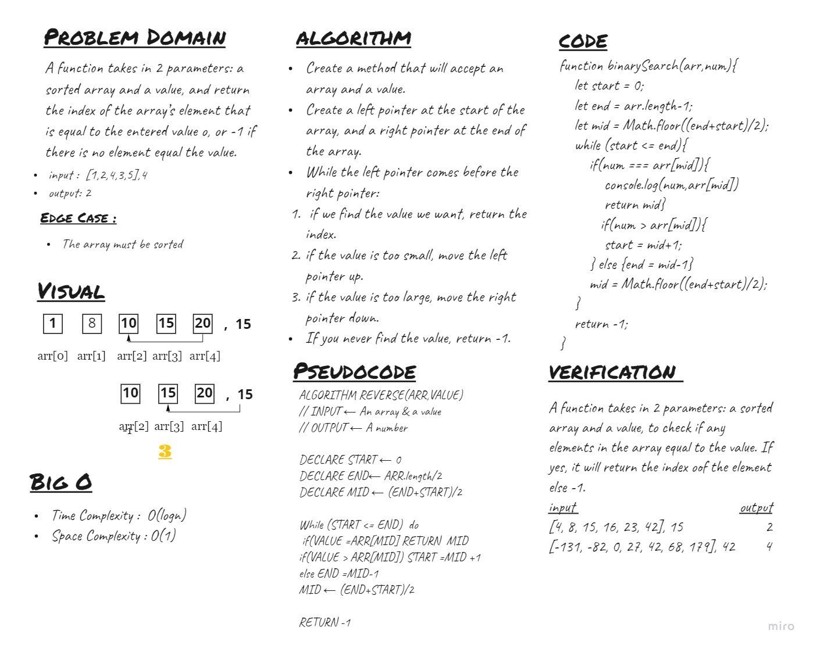

# Binary Search
A function takes in 2 parameters: a sorted array and a value, to check if any elements in the array equal to the value. If yes, it will return the index of that element else it will -1.

## Whiteboard Process

## Approach & Efficiency
<!-- What approach did you take? Discuss Why. What is the Big O space/time for this approach? -->
I've solved this problem using the pointers method to narrow down the window of search. 
* Time complexity - O(logn) 
* Space complexity - O(1)