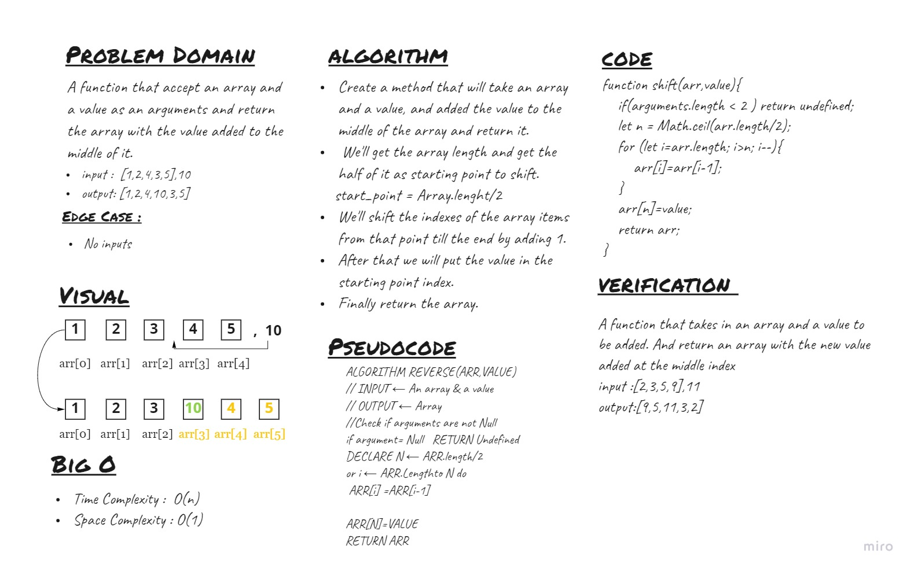

# array-insert-shift
A function that accept an array and a value as an arguments and return the array with the value added to the middle of it.

## Whiteboard Process


## Approach & Efficiency
<!-- What approach did you take? Discuss Why. What is the Big O space/time for this approach? -->
I've solved this problem using the ```for``` loop to shift the upper half of the array by 1 and add the value to the middle. 
* Time complexity - O(n) 
* Space complexity - O(1)