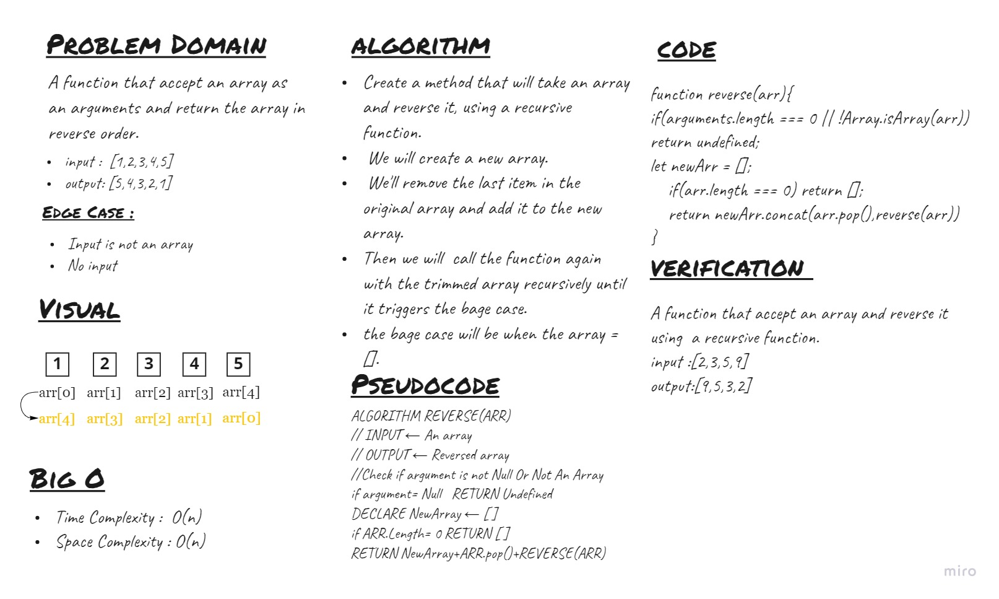

# Reverse an Array
A function that accept an array as an arguments and return the array in
reverse order.

## Whiteboard Process


## Approach & Efficiency
<!-- What approach did you take? Discuss Why. What is the Big O space/time for this approach? -->
I've tried two ways to solve this problem. First, using the ```for``` loop. Second, using a recursive function. Both of the ways have the same time & space complexity which is O(n).