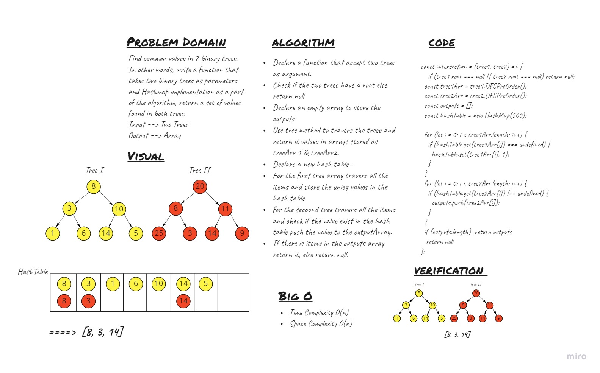

# Hashtables
<!-- Short summary or background information -->

## Challenge
<!-- Description of the challenge -->
Find common values in 2 binary trees.
In other words, write a function that takes two binary trees as parameters and Hashmap implementation as a part of the algorithm, return a set of values found in both trees.
* Input ==> Two Trees
* Output ==> Array


## Whiteboard Process


## Approach & Efficiency
<!-- What approach did you take? Why? What is the Big O space/time for this approach? -->
- I used the hash table to store the words and also to check if it's already exists.

## API
<!-- Description of each method publicly available to your Linked List -->
- ```intersection``` : return the first repeated word.

