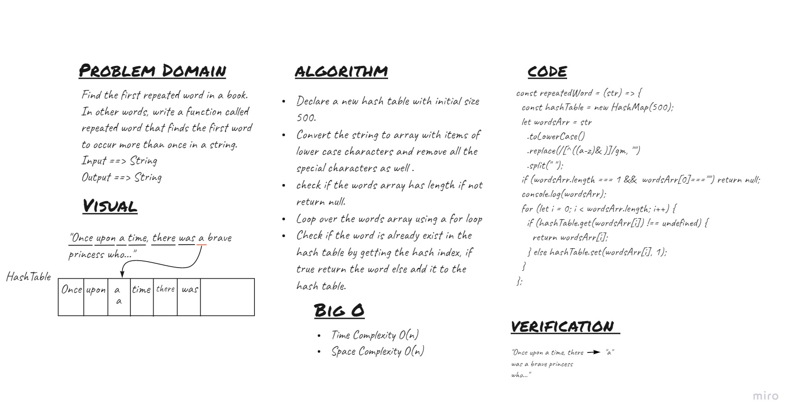

# Hashtables
<!-- Short summary or background information -->

## Challenge
<!-- Description of the challenge -->
Find the first repeated word in a book.
In other words, write a function called repeated word that finds the first word to occur more than once in a string.

## Whiteboard Process


## Approach & Efficiency
<!-- What approach did you take? Why? What is the Big O space/time for this approach? -->
- I used the hash table to store the words and also to check if it's already exists.

## API
<!-- Description of each method publicly available to your Linked List -->
- ```repeatedWord ``` : return the first repeated word.

