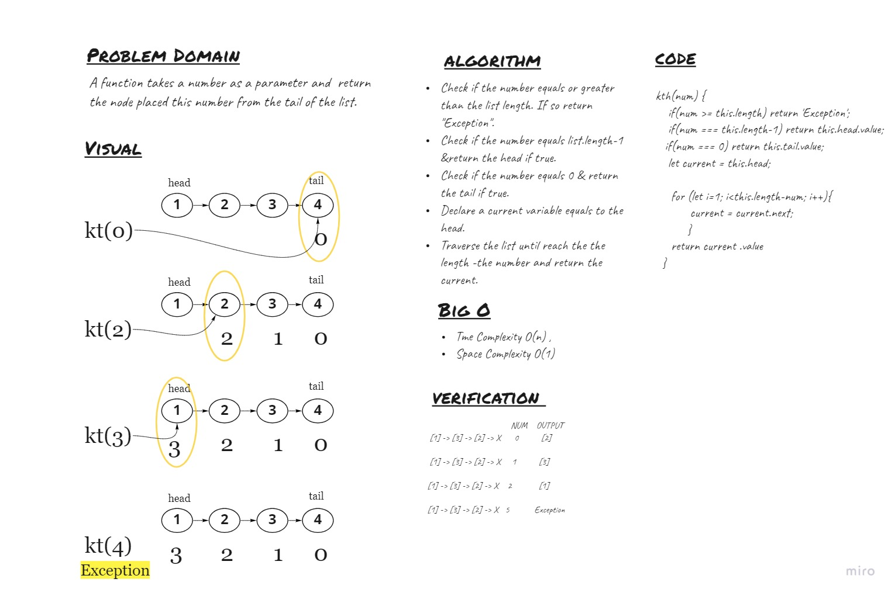

# Singly Linked List

## Challenge
<!-- Description of the challenge -->
Extend the Linked List to allow various insertion methods.
  - kth : A function takes a number as a parameter and  return the node placed in this number from the tail of the list.


## Whiteboard Process


## Approach & Efficiency
<!-- What approach did you take? Why? What is the Big O space/time for this approach? -->
- kth :  I used the for loop to traverse the list by following the number. And return the node at the end. It has O(n) time complexity & O(1) space complexity.

## API
<!-- Description of each method publicly available to your Linked List -->
- ```kth``` : return the value of the node placed in the giving number from the tail of the list.