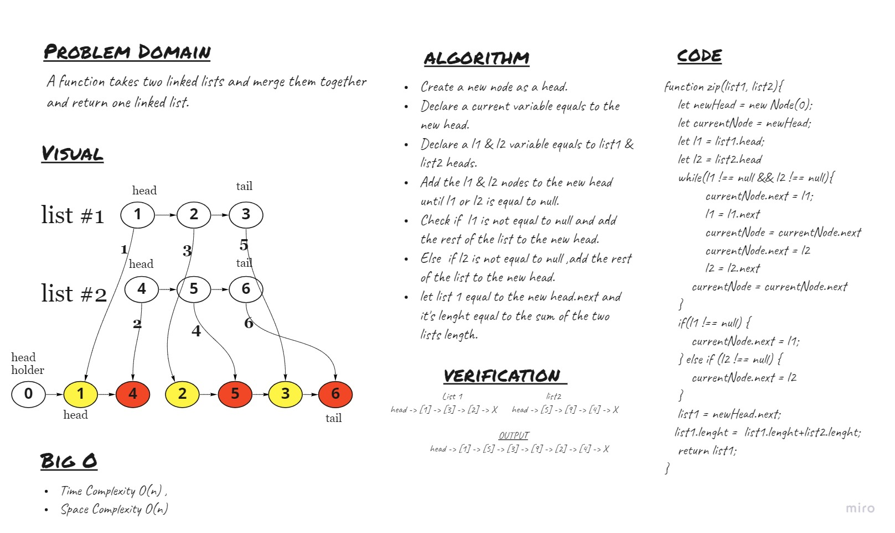

# Singly Linked List

## Challenge
<!-- Description of the challenge -->
A function takes two linked lists and merge them together and return one linked list.

## Whiteboard Process


## Approach & Efficiency
<!-- What approach did you take? Why? What is the Big O space/time for this approach? -->
-I used the while loop to traverse the two list and add thier nodes to the new head. And return the first list at end. It has O(n) time complexity & O(n) space complexity.

## API
<!-- Description of each method publicly available to your Linked List -->
- ```zib``` : return a megerd list.