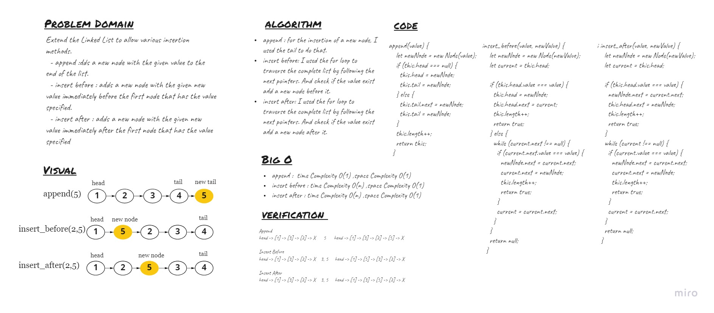

# Singly Linked List

## Challenge
<!-- Description of the challenge -->
Extend the Linked List to allow various insertion methods.
  - append :dds a new node with the given value to the end of the list.
  - insert before : adds a new node with the given new value immediately before the first node that has the value specified.
  - insert after : adds a new node with the given new value immediately after the first node that has the value specified


## Whiteboard Process


## Approach & Efficiency
<!-- What approach did you take? Why? What is the Big O space/time for this approach? -->
- append : for the insertion of a new node, I used the tail to do that. It has O(1) time complexity.
- insert befor: I used the for loop to traverse the complete list by following the next pointers. And check if the value exist add a new node before it. It hasO(n) time complexity.
- insert after: I used the for loop to traverse the complete list by following the next pointers. And check if the value exist add a new node after it. It hasO(n) time complexity.


## API
<!-- Description of each method publicly available to your Linked List -->
- ```append``` : Adds a new node with that value to the head of the list with an O(1) Time performance.
- ```insert_befor``` : Indicates whether that value exists as a Node’s value somewhere within the list and add a new node before it. O(n)-Time Complexity .
- ```insert_after``` : Indicates whether that value exists as a Node’s value somewhere within the list and add a new node after it. 