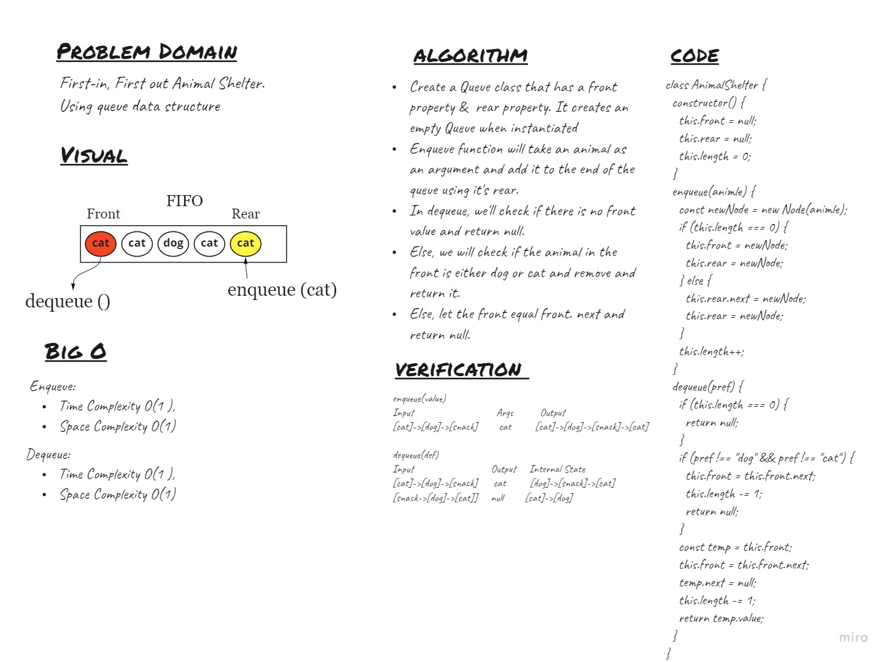

## Challenge
<!-- Description of the challenge -->
First-in, First out Animal Shelter. Using queue data structure.

## White-Board

## Approach & Efficiency
<!-- What approach did you take? Why? What is the Big O space/time for this approach? -->
* Queue
   Create a Queue class that has front and rear as properties.The class should contain the following methods:
   - enqueue
      - Arguments: animal
      - adds a new node using a first-in, first-out approach.
   - dequeue
      - Arguments:preferance animal
      - Returns: the value of the extracted value.
      - Removes the node using a first-in, first-out approach.
  
## API
   - ``enqueue`` : adds a new node with that value to the back of the queue with an O(1) Time performance.
   - ```dequeue``` : Returns the value from node from the front of the queue & Removes the node from the front of the queue.
