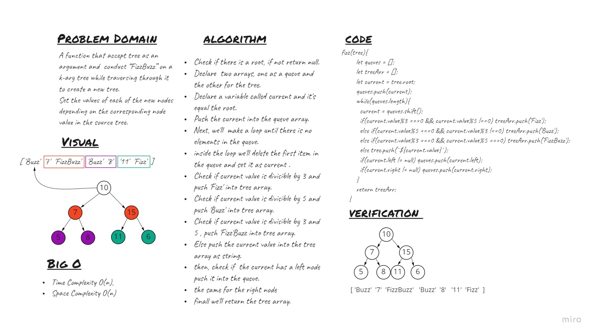

# Trees
<!-- Short summary or background information -->

## Challenge
<!-- Description of the challenge -->
A function that accept tree as an argument and  conduct “FizzBuzz” on a k-ary tree while traversing through it to create a new tree.
Set the values of each of the new nodes depending on the corresponding node value in the source tree.

## WhiteBoard



## Approach & Efficiency
<!-- What approach did you take? Why? What is the Big O space/time for this approach? -->
Breadth first
  - Arguments: k-ary tree
  - Return: new k-ary tree

## API
<!-- Description of each method publicly available in each of your trees -->
### Binary Tree
- ```fizzBuzz```


