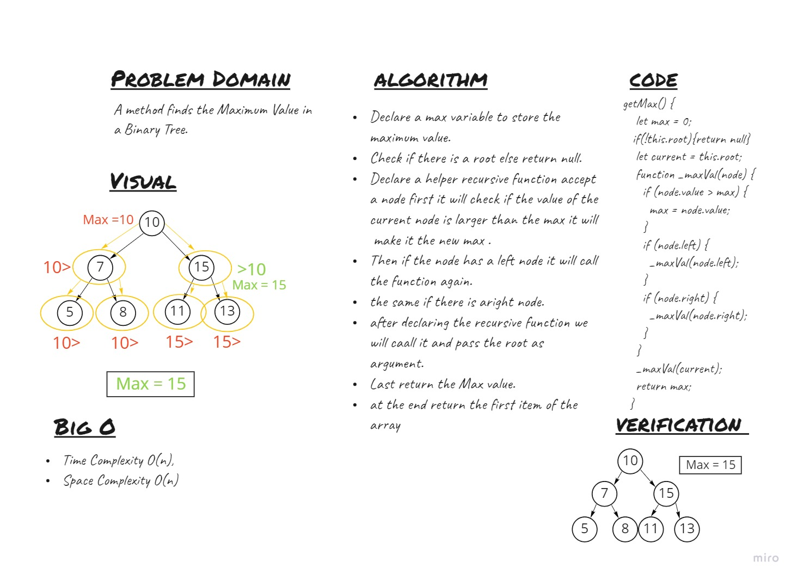

# Trees
<!-- Short summary or background information -->

## Challenge
<!-- Description of the challenge -->
Implement a method that finds the Maximum Value in a Binary Tree

## WhiteBoard



## Approach & Efficiency
<!-- What approach did you take? Why? What is the Big O space/time for this approach? -->
Find maximum value
    - Arguments: none
    - Returns: number

## API
<!-- Description of each method publicly available in each of your trees -->
### Binary Tree
- ```getMax```


